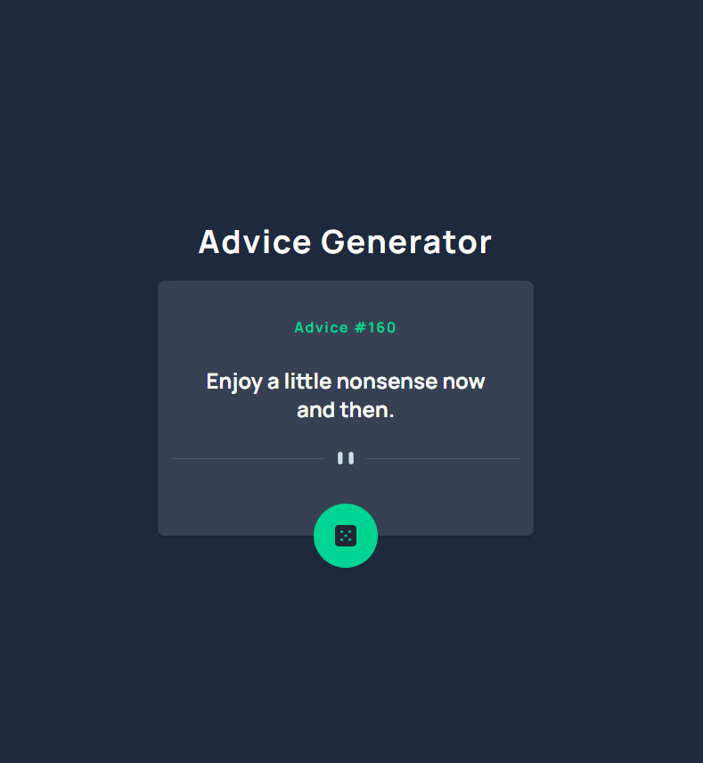

# Frontend Mentor - Advice generator app solution

This is a solution to the [Advice generator app challenge on Frontend Mentor](https://www.frontendmentor.io/challenges/advice-generator-app-QdUG-13db). Frontend Mentor challenges help you improve your coding skills by building realistic projects.

## Table of contents

-   [Overview](#overview)
    -   [The challenge](#the-challenge)
    -   [Screenshot](#screenshot)
    -   [Links](#links)
-   [My process](#my-process)
    -   [Built with](#built-with)
    -   [What I learned](#what-i-learned)
    -   [Continued development](#continued-development)
    -   [Useful resources](#useful-resources)
-   [Author](#author)

## Overview

### The challenge

Users should be able to:

-   View the optimal layout for the app depending on their device's screen size
-   See hover states for all interactive elements on the page
-   Generate a new piece of advice by clicking the dice icon

### Screenshot



### Links

-   Solution URL: [Add solution URL here](https://your-solution-url.com)
-   Live Site URL: [Add live site URL here](https://your-live-site-url.com)

## My process

### Built with

-   [React](https://reactjs.org/) - JS library
-   [Vite](https://vitejs.dev/) - Build tool
-   [Tailwind CSS](https://tailwindcss.com/) - For styles
-   Mobile-first workflow
-   Flexbox

### What I learned

During this project, I learned several valuable lessons:

1. **Responsive Design with Tailwind**

    - Using Tailwind's responsive classes for conditional rendering
    - Implementing mobile-first approach with utility classes
    - Managing breakpoints effectively

2. **React Best Practices**

    - Proper state management with useState
    - Using useEffect for data fetching
    - Component composition and reusability

3. **API Integration**
    - Fetching data from external APIs
    - Error handling and loading states
    - Async/await patterns

Here's a code snippet I'm particularly proud of:

```jsx
<div className="relative">
    <Icon name="patternDividerDesktop" className="hidden md:block mb-10" />
    <Icon name="patternDividerMobile" className="block md:hidden mb-10" />
</div>
```

This solution demonstrates clean, responsive design using Tailwind's utility classes to handle different screen sizes without JavaScript.

### Continued development

Areas I'd like to continue developing:

1. Advanced React patterns and hooks
2. More complex state management solutions
3. Testing with React Testing Library
4. Performance optimization techniques
5. Accessibility improvements
6. Add Search feature to search for specific advices
7. Save advice to a favorite list and display them in another page

### Useful resources

-   [Tailwind CSS Documentation](https://tailwindcss.com/docs) - Comprehensive guide to Tailwind's utility classes
-   [React Documentation](https://react.dev/) - Official React documentation
-   [MDN Web Docs](https://developer.mozilla.org/) - Great resource for web development fundamentals
-   [Frontend Mentor](https://www.frontendmentor.io/) - Platform for practicing frontend development

## Author

-   Frontend Mentor - [@khangbeo](https://www.frontendmentor.io/profile/khangbeo)
-   GitHub - [@khangbeo](https://github.com/khangbeo)
